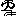

# UNISYM

> [!NOTE]
> Unifying Library for Embedded and Cross-HostOS, Cross-IDE&Lango, Cross-Platform. E.g. STM32, MSP432, CW32, x86 and RISCV, etc. -- Doshou Haruno
>
> Implemented with C++, we make interfaces of C#(Native) and Rust for embedded platforms. If these is a need, it is easy to make an interface for ASM and C instantly.

 **[Universal Symbol System](http://unisym.org)**,
also known as ゆにッシンボル, or as 統象庫,
a lossless abstract system of programming and engineering,
including not only implementation, library, tool-kits, chroming engine and demonstrations.


> [!IMPORTANT]
> The repository is open-sourced under of *Apache License 2.0*. If you copy the code and used for the public or commercial, please stipulate your <u>copying from *UNISYM* led by *ArinaMgk*</u>. 

**Hsyster** `HERSYS`

- Hierarchical Data System: `HERNOT` and public `HEREPC`
    - Herepic
        - Style Color: <font color="#FF619D">Herpink</font> <!-- (R255, G97, B157, #double-0.618)  -->
        - `{now} request MAGIC-MARK`
        - (OK)TeX&PDF, ( )HTML, ( )Markdown
- `HERPRO` and static `HERDAT`
	- Dinah (Processor and Controller Chip)
    - opensrc **UNISYM** (this Abstract Centre, Apache), up-to chip-level `arch-objfmt-env`
	- Mecocoa (General Hosted Environment), up-to board-level `board-arch-mode`
	- Witch and Nova (Graphics Rendering and Gaming)
	- COTLAB (Command-Line Interface)
	- Webnet Service

<font color="magenta">⚠︎ All the code are by hands, so these big changes and mistakes in codes may be forgiven.</font>

For example, there are harmonious identifications for linkage-identifiers and calling-parameters:

```C++
ConPrint("Hello") # Some script-interpret

ConPrint("Hello");/* CPL */

Con::Print("Hello");// C++ Static 
Con.Print("Hello");// C++ Dynamic / Global

ConPrint Hello_String; Assembly Macro

...
```

| Component        | For                                                     | As                                                         |
| ------------------ | ------------------------------------------------------------ | ------------------ |
| ASM `asm/` | sources(asm) <=> object | assembler and dis-assembler |
| DEM `demo/` | / | demonstrations and utilities |
| DOC `doc/` | / | documents, aka `HEREPC` |
| INC `inc/` | / | including files |
| LIB `lib/` | / | implementation source code (including Witch **rendering** engine) |
| MGK `magic/` | sources => sources + list + depend + target | compiler, analyzer, translator, linker, synthesizer and modifier |
| WEL `wel/` |  | Si/E-mulator |

- Constructor (Wizard) now combined into Rosemana.

**Environment Variable**

Would better to set these environment variables, if using or building UNISYM:

- `uincpath`, points to INC, a must for developer

Below are disappearing:

- `ulibpath`, points to LIB, optional
- `ubinpath`, points to BIN, a must for user
- `uobjpath`, points to OBJ, temporary folder
- `yanopath`, points to GCC cross-compilers and others
- `msvcpath`, points to Microsoft Visual C++ SDK
- `hostarget`, like `_OPT_RISCV64`, define when no target is specified

**Covenants**
- Binary Processor
- Little Endian


**Consideration** these if going to modify or using the code:

- Catalog and Manual
- Dependence
- Attribute (especially Allocation)
- Assert, strict-check and erroproc
- Aflag
- Inline and side-effect

To reduce the size of basic header, you can remove some support like STM32Fx.

---

<!-- Contributors -->

[🍨 Buy us a coffee for UNISYM project](https://www.buymeacoffee.com/arinamgk) 

-  <del> ***Phina Ren***</del>, ***Azusa***(Ren's successor)

-  ***Doshou Haruno*** 

    - **Boudoir**: http://doscon.io and dosconio series
    - **Nickname**: Ayano
    - **GitHub**: `dosconio` 
    - **Mail**: dosconyo@gmail.com 
    - **Fork**: [Dosconio-derived USYM](http://github.com/dosconio/unisym) 

- 皆さん～

