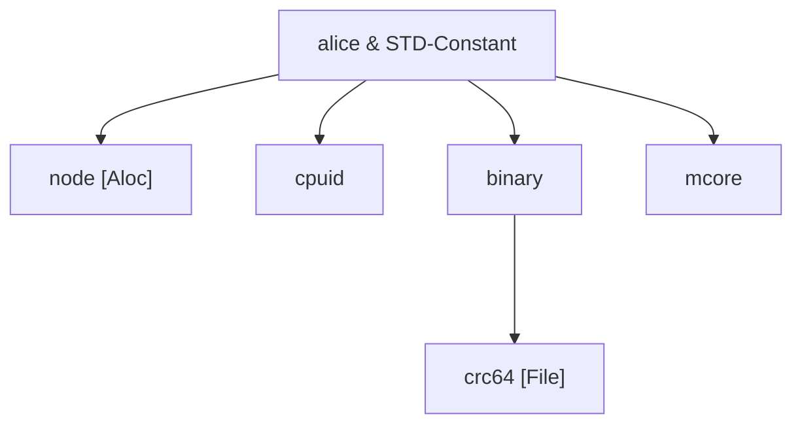

## Depend

### By module 

```mermaid
graph TB
	%% CPL
	root[alice & STD-Constant]-->node["node [Aloc]"]
	root-->cpuid[cpuid]
	root-->binary[binary]--->hash_crc64["crc64 [File]"]
	root-->mcore
```

