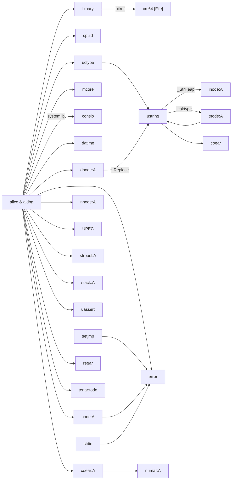

## Depend

### By module 

`[A] [Aloc]`Means containing some functions that need to **allocate** the memory space. 

```mermaid
graph LR
	%% CPL
	root[alice & aldbg]-->node[node:A]
	root-->cpuid[cpuid]
	root-->binary[binary]--bitref-->hash_crc64["crc64 [File]"]
	root-->mcore
	root--systemlib-->consio
	root-->datime
	root-->uctype-->ustring
	root-->dnode[dnode:A]--_Replace-->ustring
	ustring--_StrHeap-->inode:A
	ustring--_toktype-->tnode[tnode:A]-->ustring
	ustring-->coear
	root-->nnode:A
	root-->UPEC
	root-->strpool:A
	root-->stack:A
	root-->error
	root-->uassert
	root-->coear:A-->numar:A
	root-->regar
	root-->tenar:todo
	
	setjmp-->error
	node-->error
	stdio-->error
```

