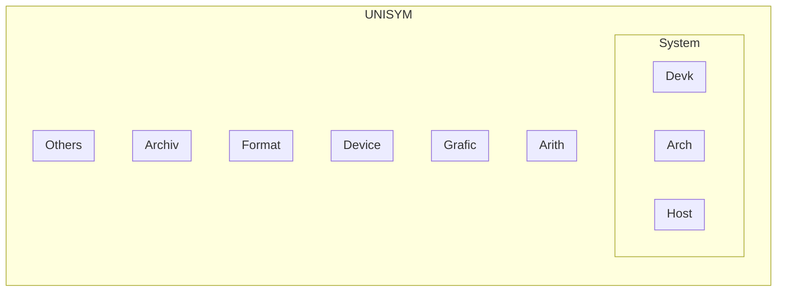

## Dependence

LaTeX GCC ANYM.AS NVCC MSVC DJGPP rustc perl python Obsidian

## Component

- Support for DEVK
	- ISO/IEC 9899 - CPL `doing`
	- Microsoft Visual C++ (MSVC) 2022
	- GNU GCC and DJ-Delorie DJGPP
	- Nvidia CUDA NVCC
	- the SDCC for i8051
- Mechanism
	- Memory Leaking Mechanism
	- Uniformed Symbols and Fitness for languages and their implementations
- Assembly
	- Kasha OSDEV Kernel
	- IBM PC MACROs for NASM and MSASM
	- Inline for C/C++
	- AASM `doing`
- Target
	- PC OSDEV Processor
	- QRS aka Embedded Controller
		- INTEL 8051: AT89C5x STC89C5x
		- STM32F1x
		- STM32F4x
		- CW32F030
	- Architecture
		- x86
		- x64
		- RISCV64
	- Platform and Board
		- IBM Compatible PC
		- Cortex M0
		- Cortex M3
		- Cortex M4
- Marking and Programming
	- Hardware Description (suspended)
	- SCH-PCB of Electronics (suspended)
	- Magice `doing`
	- C/C++
	- DotNet C# and VB `doing`
	- Rust crate `doing`
- Auxiliary
	- Qt `doing`
	- EasyX (suspended)
- Data and Collections
	- Hello World
	- Instructions for Architectures

## Modules



### Arith - Arithmetic


| String Mod | Description								  | State |
| ---------- | ------------------------------------------------------------ | ----- |
| ustring    | [ASCII] the operations for string and big-number, e.g. `2013e65535`. Besides, this contains: System-Conversion, e.g. `0x2712` to `10002`; The "u" is for distinction from that of the standard library, which means "UNISYM", **but "Unicode"**. This is going to divide into "**astring**" and "**bstring**", and "ustring" will include them. `Chr-` means ASCII string, and `Byt-` for the basic memory unit. | ripen |
| dstring    | double directions string, RFW06 created, for example, "123" is as `0xFF, 0x00, 0x31, 0x32, 0x33, 0x00 `. The structure is convenient for reverse printing, 0xFF means the head of the memory, the pointer should point to "`0x31`". | todo  |
| wstring    | [ANSI, wide char]							  | todo  |
| u8string   | [UTF-8, multi-byte]							| todo  |


| String Arithmetic | Description								  | Special			    | ErrProc				    | State    |
| ----------------- | ------------------------------------------------------------ | ---------------------------- | ---------------------------------- | -------- |
| **BitAr**	   | [optional endian] for any size.					|					|						| todo     |
| **TriAr**	   |										  |					|						| todo     |
| **SixAr**	   |										  |					|						| todo     |
| **ChrAr**(base)   | [big endian] [variable-length] optional signed ASCII integer arithmetic  and operations, for buffer or heap, which can be printed directly. Now exists the optional dependence of `arna_eflag`.  <br> **alias**: `BytAr` and `ASCAr` and `StrAr` <br> **digit size**: `char` <br> **structure**: optional`sign`  + ASCIZ-string`digits` <br> **where**: stack or buffer(0 in `bstring`) or heap(1 in `hstring`) <br> **efficiency**: 10.1/256 (0.1 for sign digit and NUL) <br> **range**: any real number |					|						| ripen    |
| **FltAr**(1)	| [big endian] `{{Sign, ChrAr}, ExpoInDec }` the extension of **ChrAr**. But any fltar-number is fixed-size. If the result is too big, the magic number "999… . …999" will be expressed. For the fixed size of floating part, the result may be cut to adapt to the structure. Natural and only for **buffer** version. |					|						| todo     |
| **CdeAr**(1)	| [big endian] Arinae classic structure, Coff-expo-divr, based on **ChrAr**. the mechanism can express and operate any big-rational-real-number. The name follows what ArnMgk called this. | `+/-INF`, `NaN`,temp no `-0` | element and `aflag`, little `erro` | ripen    |
| **NumAr**(4)	| [big endian] the mechanism can express and operate the big-rational-real-numbers (not endless) in 4 dimensions of time and room, or real and imaginary, based on **CdeAr**. <br>Version: C, C++{TODO} |					|						| ripen    |
| **RsgAr**(base)   | [little endian] Based on 256. Use the register-size unit for faster arithmetic speed. E.g. `0x12, 0x34` for 0x3412 |					|						| ripen    |
| **RedAr**(1)	| [big endian] Dosconio's base 256 expo-unit 16 extension. C-E-D structure based on **RsgAr**. the mechanism can express and operate any big-rational-real-number. |					|						| building |
| **HrnAr**(4)	| [little endian] 4D based on **RegAr**				|					|						| todo     |
| **BytAr**(base)   | [optional endian] base 256  for signed integer, whose the first byte is the flag byte. E.g. `0x12, 0x34` for 0x3412 or 0x1234. |					|						| todo     |
| **DecAr**(base)   | [optional endian] base 100/256 for signed integer, whose the first byte is the flag byte. The first binary of the first is the sign bit and of the others are state flags. E.g. `0x12, 0x34` for 0d3412 or 0d1234. |					|						| todo     |
| **ArnAr**(1)	| [optional endian] Arinae classic structure based on **BytAr**, base 256 expo-unit 256. the mechanism can express and operate any big-rational-real-number. The expo and divr are optional. |					|						| todo     |
| **TenAr**(\*,\*)  | Haruno no. Operations for tensor(different sizes and types in an array) and array. |					|						| todo     |
| **MtrAr**(n,2)    | Matrix Arithmetic							  |					|						| todo     |


| Kasha component | Description						 | State |
| --------------- | ----------------------------------------------- | ----- |
| arith	     | Arithmetic						  | ripen |
| cpuins	    | CPU Information					   | ripen |
| hdisk	     | Hard-disk						   | ripen |
| osdev	     | OSDEV Special					     | ripen |
| pseudo	    | Pseudo structure for NASM and others assemblers | ripen |
| timer	     | Date and time					     | ripen |
| video	     | Video display					     | ripen |

| Module   | Description   | State |
| -------- | ------------- | ----- |
| contable | Console Table | ripen |
| consio   | Console IO    | ripen |

| Hash  | Description					  | State |
| ----- | ------------------------------------------ | ----- |
| CRC64 | Cyclic Redundancy Check with 64-bit result | ripen |


## Removed

- sequence -> vector
- tnode inode
- [GOING] cinc


```
