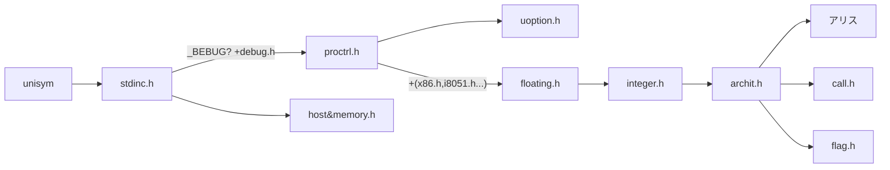
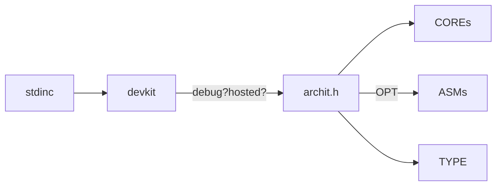
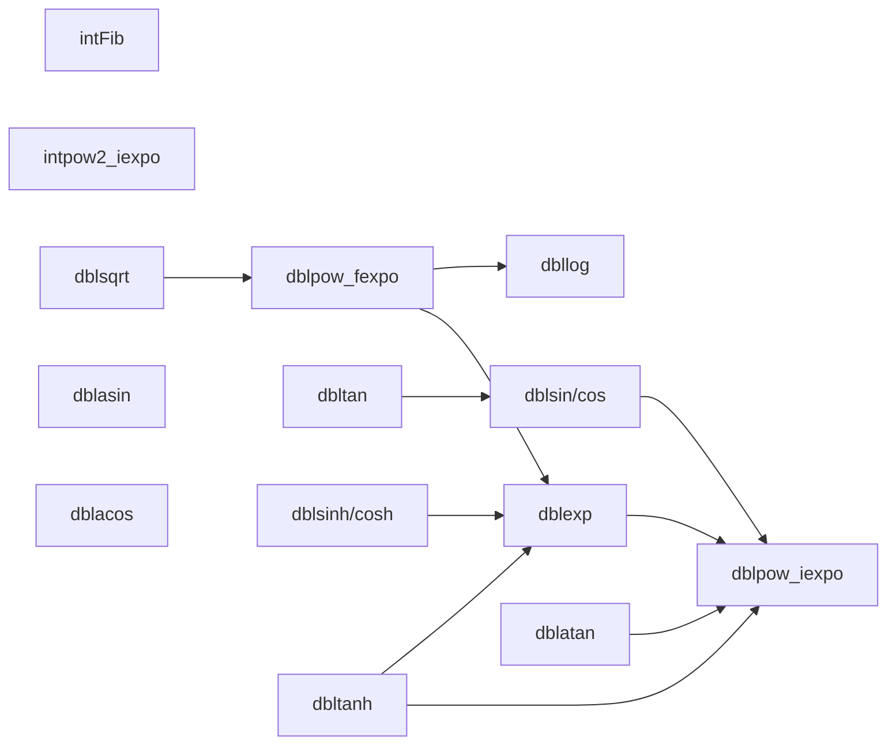

## Depend Map

Version = ARCH (register & instruction) + HOST (os) + BITS (4/8/16/32/64...), except DEVK

(Omit the common reference `Core`)

>Different from other graph: point to reference but dependence

### Host

Host = Arch(destination system), Core(common system) and Devk(developing system)

> 20240502: With the development of UNISYM, the including files of Core is bound to be complex and huge, it is necessary to ask users to use specific file but the only `stdinc`, more to see in `5-Compatible.md`. 

- [ ] make these true since next generation (Release-U2025SPR):
	- [ ] Arch + Devk --include--> Core
	- [ ] make C and C++ Header into one `.h`

>Why there will be Archi and Devk?
>: For leak of determinism in language and compiler-system, e.g. the length of `int`, while Magice make these built-in rules so we need not provide `Syst` in UNISYM library but Magice-Compiler-Chain.

>Is Core dependent?
>: She is a abstract and independent completely, you can also take it `Orig` or `Love`❤.

>Why UNISYM update slowly and a bit complex?
>: There were few contributors and they were busy with living and feeding their families.

>"The code of UNISYM is so useless or ugly!" ?
>: It is your free to choose how to use. If YOU take anything for granted, there is nothing to say.

Next generation

Arch+Board+HostOS+Devkit

### Bootstrapping Building Circuit

### Arith - Arithmetic

- CoeAr
- Builtin-floating functions

Often-used
- dblabs

Single
- ariprecise

