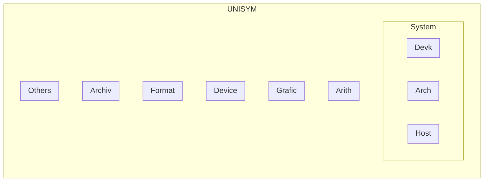

## Component

- Support for DEVK
	- ISO/IEC 9899 - CPL `doing`
	- Microsoft Visual C++ (MSVC) 2022
	- GNU GCC and DJ-Delorie DJGPP
	- Nvidia CUDA NVCC
	- the SDCC for i8051
- Mechanism
	- Memory Leaking Mechanism
	- Uniformed Symbols and Fitness for languages and their implementations
- Assembly
	- Kasha OSDEV Kernel
	- IBM PC MACROs for NASM and MSASM
	- Inline for C/C++
	- AASM `doing`
- Target
	- PC OSDEV Processor
	- QRS aka Embedded Controller
		- INTEL 8051: AT89C5x STC89C5x
		- `STM32F10x`
		- `STM32F4x`
		- CW32F030
	- Architecture
		- x86
		- x64
		- RISCV64
- Marking and Programming
	- Hardware Description (suspended)
	- SCH-PCB of Electronics (suspended)
	- Magice `doing`
	- C/C++
	- DotNet C# and VB `doing`
	- Rust crate `doing`
- Auxiliary
	- Qt `doing`
	- EasyX (suspended)
- Data and Collections
	- Hello World
	- Instructions for Architectures

## Modules



The relationships like dependence, to see [Depend](./6-Depend.md).

- `Core` (alice.h & trait.h)
	- uassert.h
	- property
	- reference
	- Trait: Array & LinearNodeChain
	- Trait: Iterate
- `System` (stdinc.h=unisym basic)
	- `Devk` (host.h)
		- call.h
		- debug.h
		- cinc
		- ISO_IEC_STD/
	- `Host` Hosted Environment
		- error.h
		- memory.h
		- task.h
		- ustring.h string
		- interrupt
	- `Arch`  (archit.h and c/architect/)
		- binary.h binary
		- cpuid.h cpuid
		- flag.h
		- `integer/` integer.h integer
		- floating.h floating
		- port.h port
		- proctrl.h
		- uctype.h
		- uoption.h
		- ustdbool.h
		- pointer
		- compile/
		- proctrl/ and MCU/
			-{chores}
			- ST
			- XY
- `Arith` (arith.h)
	- instruction.h
	- coear.h coear
	- regar.h
	- numar.h number(.h)
	- tenar.h
	- int128
	- comparison {TOIN TORE-DIR}
	- algorithm
		- compare
		-        --> sort
		-        --> search
		- Frequency
			- Fourier
	* riscv64
> You have to choose the architecture yourself, without the help of hosted characters.

- `Grafic` Graphics and Witch (`graphic.h` and graphic/) {TODO NO-DEP}
	- color.h
	- contable.h
	- Frame/
		- Qt
	- Witch/
- `Device` (cpp/Device/ and cpp/driver/) {TODO NO-DEP}
	- `Conio` {TODO NO-DEP}
		- consio.h console stream
	- ADC and ADConverter/
		- XPT2046.h
	- Video/ and Video
		- video.h
		- ILI9320
		- ILI9341
		- video.h
	- Radio
		- RDA5820 (:IIC)
		- TEA5767 (:IIC)
	- [Protocol, Interface and Wire]
		- IIC, aka I2C
		- OneWire.h
	- AT24C02.h ()
	- DS1302.h ()
	- DS18B20.h ()
	- HD44780.h ()
	- i8253A.h ()
	- i8259A.h ()
	- keyboard.h
	- LCD12864.h (specific LCD)
	- LCD1602.h (specific LCD)
	- nixietube.h
	- PIT.h
	- RealtimeClock.h
	- timer.h
	- UART
	- RCC/
	- Systick
	- SysClock
	- AFIO
	- EXTI and NVIC (interrupt)
	- GPIO
	- nixietube
- `Format` (format/) {TODO NO-DEP}
	- `Charset::Widechar` (widechar.h) {TODO}
		- GBK.h {TODO}
	- `Charset::Multichar` (multichar.h) {TODO}
		- upec.h {TOIN}
		- UTF-8.h {TODO}
	- Encode:: crc64.h
	- Time:: datime.h
	- Buffer:: stack.h stack >> Trait
	- Buffer:: strpool.h strpool >> Trait
	- Buffer:: queue >> Trait
	- Array-Series
		- `Node` [Node-Data-System](./modules/Nodes.md)
		- vector
	- File:: ELF.h
	- FileSys:: FAT12.h
- Archiv (big scale, alias `Data`)
	- Assembly Instructions
	- DEMO and .picture
- Locale
	- loc.h
- Others
	- sig.h
	- Kasha
	- msasm
	- naasm
	- Python
	- Rust `unisym::`
	- ...


### ! Controversial or Not-stable Modules

- Inode

The below are stable contents.

### Arith - Arithmetic


| String Mod | Description								  | State |
| ---------- | ------------------------------------------------------------ | ----- |
| ustring    | [ASCII] the operations for string and big-number, e.g. `2013e65535`. Besides, this contains: System-Conversion, e.g. `0x2712` to `10002`; The "u" is for distinction from that of the standard library, which means "UNISYM", **but "Unicode"**. This is going to divide into "**astring**" and "**bstring**", and "ustring" will include them. `Chr-` means ASCII string, and `Byt-` for the basic memory unit. | ripen |
| dstring    | double directions string, RFW06 created, for example, "123" is as `0xFF, 0x00, 0x31, 0x32, 0x33, 0x00 `. The structure is convenient for reverse printing, 0xFF means the head of the memory, the pointer should point to "`0x31`". | todo  |
| wstring    | [ANSI, wide char]							  | todo  |
| u8string   | [UTF-8, multi-byte]							| todo  |


| String Arithmetic | Description								  | Special			    | ErrProc				    | State    |
| ----------------- | ------------------------------------------------------------ | ---------------------------- | ---------------------------------- | -------- |
| **BitAr**	   | [optional endian] for any size.					|					|						| todo     |
| **TriAr**	   |										  |					|						| todo     |
| **SixAr**	   |										  |					|						| todo     |
| **ChrAr**(base)   | [big endian] [variable-length] optional signed ASCII integer arithmetic  and operations, for buffer or heap, which can be printed directly. Now exists the optional dependence of `arna_eflag`.  <br> **alias**: `BytAr` and `ASCAr` and `StrAr` <br> **digit size**: `char` <br> **structure**: optional`sign`  + ASCIZ-string`digits` <br> **where**: stack or buffer(0 in `bstring`) or heap(1 in `hstring`) <br> **efficiency**: 10.1/256 (0.1 for sign digit and NUL) <br> **range**: any real number |					|						| ripen    |
| **FltAr**(1)	| [big endian] `{{Sign, ChrAr}, ExpoInDec }` the extension of **ChrAr**. But any fltar-number is fixed-size. If the result is too big, the magic number "999… . …999" will be expressed. For the fixed size of floating part, the result may be cut to adapt to the structure. Natural and only for **buffer** version. |					|						| todo     |
| **CdeAr**(1)	| [big endian] Arinae classic structure, Coff-expo-divr, based on **ChrAr**. the mechanism can express and operate any big-rational-real-number. The name follows what ArnMgk called this. | `+/-INF`, `NaN`,temp no `-0` | element and `aflag`, little `erro` | ripen    |
| **NumAr**(4)	| [big endian] the mechanism can express and operate the big-rational-real-numbers (not endless) in 4 dimensions of time and room, or real and imaginary, based on **CdeAr**. <br>Version: C, C++{TODO} |					|						| ripen    |
| **RsgAr**(base)   | [little endian] Based on 256. Use the register-size unit for faster arithmetic speed. E.g. `0x12, 0x34` for 0x3412 |					|						| ripen    |
| **RedAr**(1)	| [big endian] Dosconio's base 256 expo-unit 16 extension. C-E-D structure based on **RsgAr**. the mechanism can express and operate any big-rational-real-number. |					|						| building |
| **HrnAr**(4)	| [little endian] 4D based on **RegAr**				|					|						| todo     |
| **BytAr**(base)   | [optional endian] base 256  for signed integer, whose the first byte is the flag byte. E.g. `0x12, 0x34` for 0x3412 or 0x1234. |					|						| todo     |
| **DecAr**(base)   | [optional endian] base 100/256 for signed integer, whose the first byte is the flag byte. The first binary of the first is the sign bit and of the others are state flags. E.g. `0x12, 0x34` for 0d3412 or 0d1234. |					|						| todo     |
| **ArnAr**(1)	| [optional endian] Arinae classic structure based on **BytAr**, base 256 expo-unit 256. the mechanism can express and operate any big-rational-real-number. The expo and divr are optional. |					|						| todo     |
| **TenAr**(\*,\*)  | Haruno no. Operations for tensor(different sizes and types in an array) and array. |					|						| todo     |
| **MtrAr**(n,2)    | Matrix Arithmetic							  |					|						| todo     |


| Kasha component | Description						 | State |
| --------------- | ----------------------------------------------- | ----- |
| arith	     | Arithmetic						  | ripen |
| cpuins	    | CPU Information					   | ripen |
| hdisk	     | Hard-disk						   | ripen |
| osdev	     | OSDEV Special					     | ripen |
| pseudo	    | Pseudo structure for NASM and others assemblers | ripen |
| timer	     | Date and time					     | ripen |
| video	     | Video display					     | ripen |

| Module   | Description   | State |
| -------- | ------------- | ----- |
| contable | Console Table | ripen |
| consio   | Console IO    | ripen |

| Hash  | Description					  | State |
| ----- | ------------------------------------------ | ----- |
| CRC64 | Cyclic Redundancy Check with 64-bit result | ripen |

## Index

```
├─c
│  alice.h [Core] 
│  anode.h [Node]
│  archit.h [Arch]
│  arith.h [Arith]
│  binary.h [Arch]
│  call.h [Devk]
│  coear.h [Arith]
│  consio.h [Conio]
│  cpuid.h [Arch]
│  crc64.h [Format]
│  datime.h [Format]
│  debug.h [Devk]
│  dnode.h [Node]
│  error.h [Host]
│  flag.h [Arch]
│  floating.h [Arch]
│  graphic.h [Graf]
│  host.h [Host]
│  inode.h [Node]
│  integer.h [Arch]
│  loc.h [Locale]
│  memory.h [Host]
│  nnode.h [Node]
│  node.h [Node]
│  nodes.h [Node]
│  numar.h [Arith]
│  number.h [Arith]
│  port.h [Arch]
│  proctrl.h [Arch]
│  regar.h [Arith]
│  sig.h
│  stack.h [Format]
│  stdinc.h [Syst]
│  strpool.h [Format]
│  task.h [Host]
│  tenar.h [Arith]
│  trait.h [Core]
│  uassert.h [Core]
│  uctype.h [Arch]
│  uoption.h [Arch]
│  upec.h [Format]
│  ustdbool.h [Arch]
│  ustring.h [Host]
├─algorithm ...
├─architect [Arch]
│	arcintel_8051.h
│	arcriscv_64.h
│	arcx64_win64.h
│	
├─com {TODEL}
│	
├─compile [Arch]
│	asmcode.h
│	
├─driver [Device] ...
├─format [Format]
│	ELF.h
│	FAT12.h
│	
├─graphic [Graf]
│	color.h
│	contable.h
│	
├─integer [Arch] ...
├─ISO_IEC_STD [Devk] ...
│	
├─MCU
│  │  delay.h
│  │  mcu.txt
│  │  port.h
│  │  
│  ├─Intel
│  │	i8051.h
│  │	keil8051.h
│  │	sdcc8051.h
│  │	
│  ├─MSP432
│  │	MSP432P401R.h
│  │	
│  └─ST
└─proctrl [Arch] {TODO: contain MCU}
    └─x86
		inst_x86_64.h
		x86.h
├─cpp
│  basic [Syst]
│  binary
│  bnode
│  cinc
│  coear
│  comparison
│  console
│  cpuid
│  dnode
│  floating
│  gnode
│  inode
│  int128
│  integer
│  interrupt
│  nnode
│  node
│  nodes
│  number
│  pnode
│  pointer
│  port
│  property
│  queue
│  reference
│  stack
│  stream
│  string
│  strpool
│  unisym
│  
├─Device ...
│	    
├─driver
│	nixietube
│	
├─Frame
│	Qt
│	
├─MCU
│  ├─ST
│  │	STM32F103VEx
│  │	STM32F4 STM32F407ZEx
│  │	
│  └─XY
│	    CW32F003
│	    
└─Witch
	│  Form
	│  MessageBox
	│  Witch
	│  
	└─Control
		Button
├─gnuas
│	g_ustring.asm
│	
├─Kasha ...
│	
├─msasm (Interrupts and string)
│  │  INT....asm
│  │  ustring.asm
│  │  
│  └─driver
│		  
├─naasm (Interrupts and string)
│	n_....a
│	n_string.a
│	
└─Python

## Removed

- sequence -> vector
- tnode inode


```
