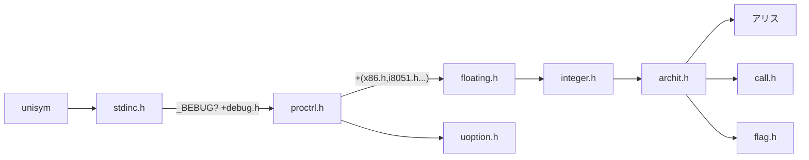
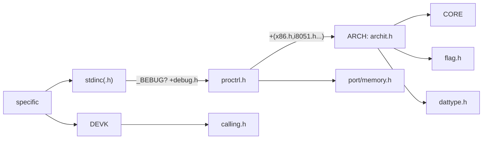

Free-stand Environment:
- Core
- Math

Hosted Environment:
- Host

## Depend Map

`[A] [Aloc]`Means containing some functions that need to **allocate** the memory space. 


to renew :
```
graph LR
	%% UNISYM
	%% @ArinaMgk
	root[alice & aldbg]-->node[node:A]
	root-->cpuid[cpuid]
	root-->binary[binary]--bitref-->hash_crc64["crc64 [File]"]
	root-->mcore
	root--systemlib-->consio
	root-->datime
	root-->uctype-->ustring
	root-->dnode[dnode:A]--_Replace-->ustring
	ustring--_StrHeap-->inode:A
	ustring--_toktype-->tnode[tnode:A]-->ustring
	ustring-->coear
	root-->nnode:A
	root-->UPEC
	root-->strpool:A
	root-->stack:A
	root-->error
	root-->uassert
	root-->coear:A-->numar:A
	root-->regar
	root-->tenar:todo
	
	setjmp-->error
	node-->error
	stdio-->error
```


### Syst

Syst = Arch(destination system), Core(common system) and Devk(developing system)

> 20240502: With the development of UNISYM, the including files of Core is bound to be complex and huge, it is necessary to ask users to use specific file but the only `stdinc`, more to see in `5-Compatible.md`. 

- [ ] make these true since next generation (Release-U2025XXX):
	- [ ] Arch + Devk --include--> Core

>Why there will be Archi and Devk?
>: For leak of determinism in language and compiler-system, e.g. the length of `int`, while Magice make these built-in rules so we need not provide `Syst` in UNISYM library but Magice-Compiler-Chain.

>Is Core dependent?
>: She is a abstract and independent completely, you can also take it `Orig` or `Love`❤.

>Why UNISYM update slowly and a bit complex?
>: There were few contributors and they were busy with living and feeding their families.



Next generation




### Bootstrapping Circuit


### Arithmetic

- CoeAr
- Builtin-floating functions


