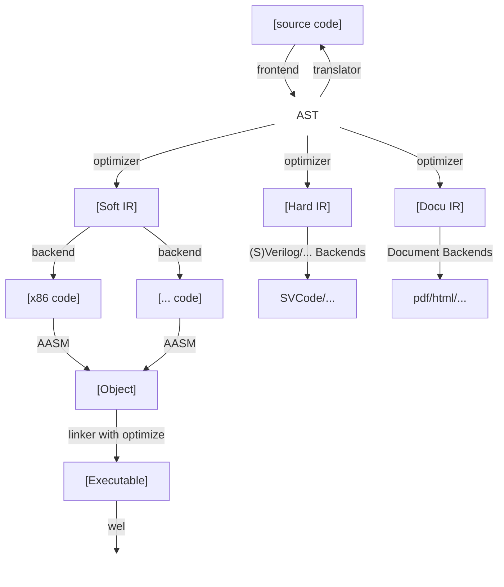

# magice compiler

M(markdesc), G(harddesc), C(softcode) -- 20261027

```mermaid
flowchart TB
    SRC["[source code]"]
    IRs["[Soft IR]"]
    IRh["[Hard IR]"]
    IRd["[Docu IR]"]
	ASMx86["[x86 code]"]
	ACMOTH["[... code]"]
    OBJ["[Object]"]
    EXE["[Executable]"]

    SRC -->|frontend| H1["AST"]
    H1 -->|optimizer| IRs
    H1 -->|optimizer| IRh
    H1 -->|optimizer| IRd
    H1 -->|translator| SRC
    IRs -->|backend| ASMx86
    IRs -->|backend| ACMOTH
	ASMx86 -->|AASM| OBJ
	ACMOTH -->|AASM| OBJ
    OBJ -->|linker with optimize| EXE
    EXE -->|wel| H2[" "]

	IRh --> |"(S)Verilog/... Backends"| H3["SVCode/..."]
	IRd --> |"Document Backends"| H4["pdf/html/..."]

    style H1 fill:none,stroke:none,color:none
    style H2 fill:none,stroke:none,color:none
```

Chinese documents
- [MAgRK](./.doc/magrk-zh/magrk.zh.md)

